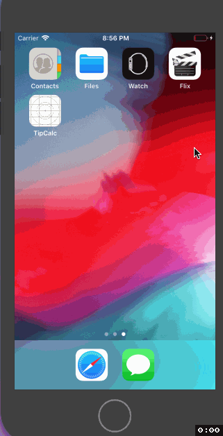

# Flix

Flix is an app that allows users to browse movies from the [The Movie Database API](http://docs.themoviedb.apiary.io/#).

## Flix Part 2

### User Stories

#### REQUIRED (10pts)
- [x] (5pts) User can tap a cell to see more details about a particular movie.
- [x] (5pts) User can tap a tab bar button to view a grid layout of Movie Posters using a CollectionView.

#### BONUS
- [x] (2pts) User can tap a poster in the collection view to see a detail screen of that movie.
- [x] (2pts) In the detail view, when the user taps the poster, a new screen is presented modally where they can view the trailer.

### App Walkthough GIF

### Notes
The most challenging part in this assignment is adding a trailer in our flix app. It was a challenge on how we could utilize some codes that we have used in the first part of the assignment with only some variations, especially that we haven't fully explored network requests yet. 

---

## Flix Part 1

### User Stories

#### REQUIRED (10pts)
- [x] (2pts) User sees an app icon on the home screen and a styled launch screen.
- [x] (5pts) User can view and scroll through a list of movies now playing in theaters.
- [x] (3pts) User can view the movie poster image for each movie.

#### BONUS
- [x] (2pt) User can view the app on various device sizes and orientations.
- [x] (1pt) Run your app on a real device.

### App Walkthough GIF

### Notes
The guide in building this app was clear and concise, that is why I didn't encounter any problems. However, since I'm still new to Swift and iOS development, doing the bonus features was probably the challenging part of this assignment, specifically familiarizing myself with constraints in order to make the app viewable in different device sizes and orientations.
